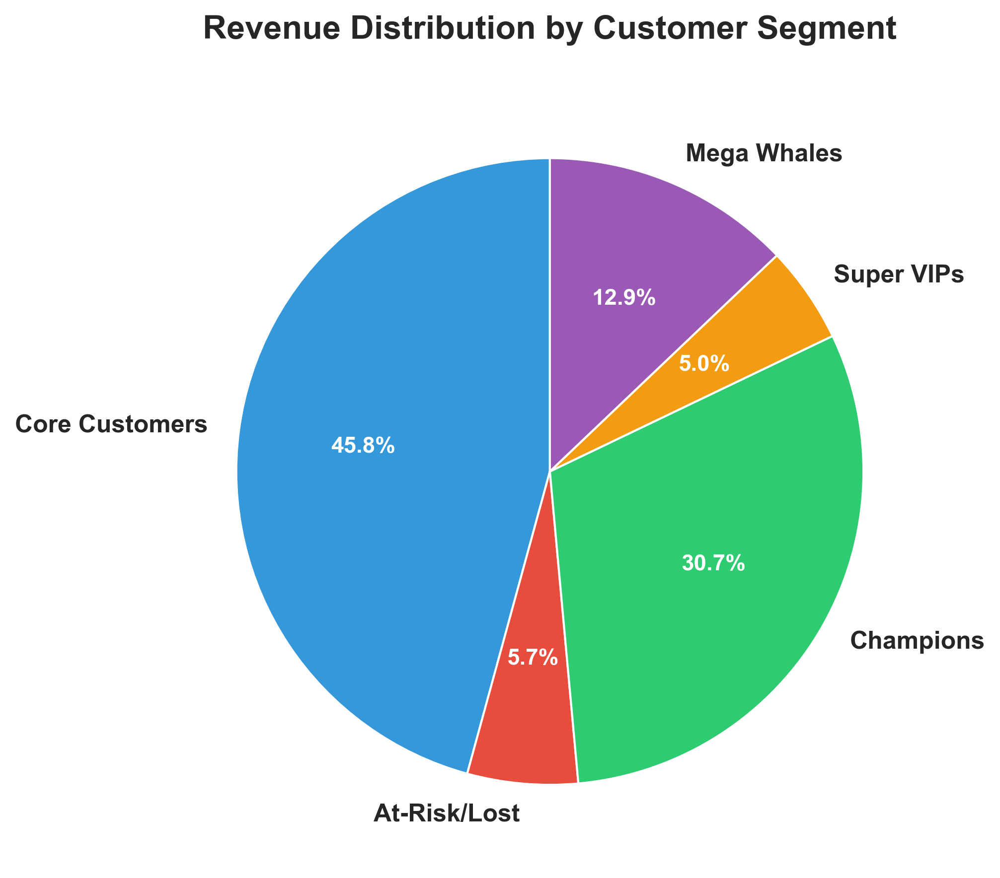
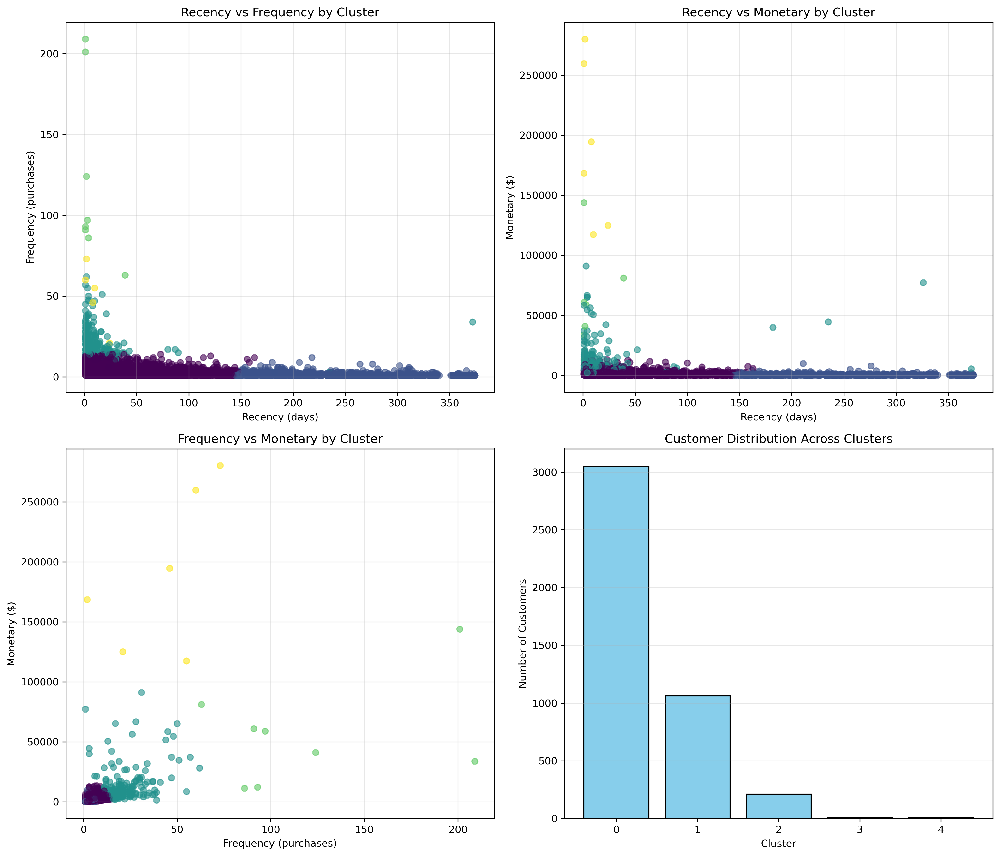
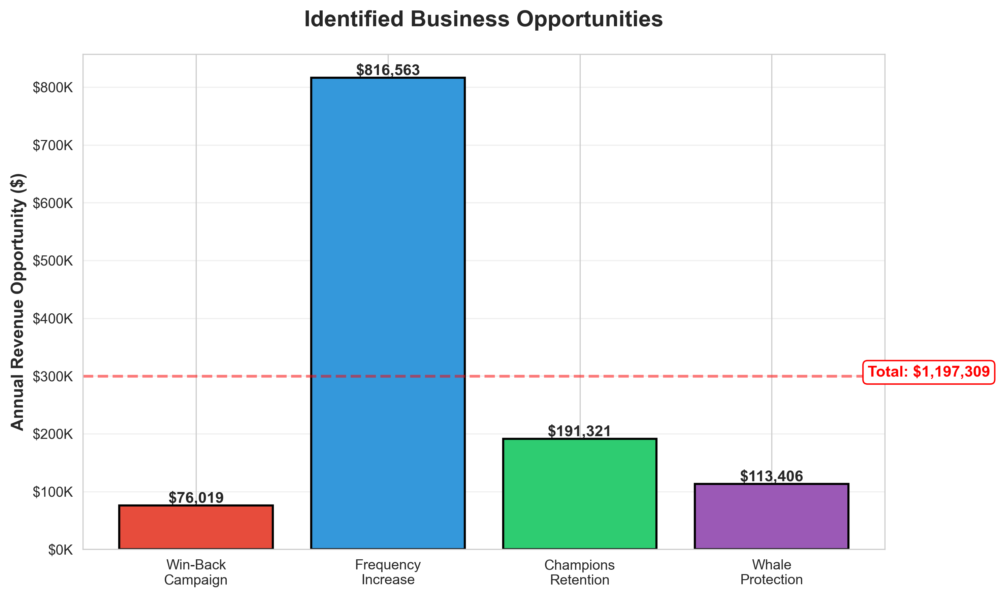

# Customer Segmentation Analysis - RFM & K-Means Clustering


## 📊 Project Overview

Behavioral segmentation of 4,338 e-commerce customers using RFM (Recency, Frequency, Monetary) analysis and K-Means clustering to identify distinct customer groups and quantify revenue opportunities.

**Key Finding:** 5% of customers generate 48.6% of total revenue ($4.32M).

**Business Impact:** Identified $1.2M in annual revenue opportunities through targeted retention and engagement strategies.

---

## 🎯 Business Problem

An e-commerce company with a diverse customer base needed to:
- Segment customers based on purchasing behavior
- Identify high-value customer groups
- Optimize marketing budget allocation
- Reduce churn among valuable customers

---

## 🔧 Methodology

### 1. Data Cleaning
- **Original dataset:** 541,909 transactions
- **After cleaning:** 397,884 transactions (removed nulls, negatives, returns)
- **Customers analyzed:** 4,338 unique customers
- **Time period:** December 2010 - December 2011

### 2. RFM Analysis
Calculated three metrics for each customer:
- **Recency (R):** Days since last purchase
- **Frequency (F):** Number of purchases
- **Monetary (M):** Total spending

Assigned 1-5 scores for each metric using quintiles.

### 3. K-Means Clustering
- **Optimal clusters:** k=5 (determined via Elbow Method & Silhouette Score)
- **Normalization:** StandardScaler to ensure equal feature weighting
- **Validation:** Silhouette Score = 0.617 (excellent separation)

### 4. Segment Profiling
Named and characterized each cluster based on RFM patterns and business value.

---

## 📈 Results

### Customer Segments Identified

| Segment | Size | Revenue Share | Avg. Monetary | Characteristics |
|---------|------|---------------|---------------|-----------------|
| **Core Customers** | 3,049 (70.3%) | 45.8% | $1,339 | Regular buyers, moderate spending |
| **Champions** | 213 (4.9%) | 30.7% | $12,832 | Frequent, high-value, recent buyers |
| **At-Risk/Lost** | 1,062 (24.5%) | 5.7% | $478 | Dormant 8+ months, low engagement |
| **Super VIPs** | 8 (0.2%) | 5.0% | $55,313 | Ultra-frequent buyers (121 avg purchases) |
| **Mega Whales** | 6 (0.1%) | 12.9% | $190,863 | Top-tier accounts, extreme high-value |

### Business Opportunities Quantified

**Total Annual Revenue Opportunity: $1,197,309**

1. **Win-Back Campaign:** $76,019 (15% recovery of At-Risk segment)
   - ROI: 660% on $10K campaign cost

2. **Frequency Increase:** $816,563 (20% boost in Core Customer purchases)
   - Strategy: Email campaigns + loyalty rewards

3. **Champions Retention:** $191,321 (VIP program reduces churn 12%→5%)
   - ROI: 283% on $50K program cost

4. **Whale Protection:** $113,406 (Dedicated account manager prevents 1 churn)
   - ROI: 42% on $80K annual cost

---

## 🛠️ Technologies Used

- **Python 3.9+**
- **pandas** - Data manipulation and analysis
- **scikit-learn** - K-Means clustering, StandardScaler
- **matplotlib & seaborn** - Data visualization
- **Jupyter Notebook** - Interactive development

---

## 📁 Project Structure
```
├── customer_segmentation.ipynb    # Main analysis notebook
├── data/                          # Raw and processed data
├── outputs/                       # RFM scores and segment assignments
├── visualizations/                # Charts and plots
├── portfolio/                     # Case study PDF
└── requirements.txt               # Python dependencies
```

---

## 🚀 How to Run

1. **Clone the repository:**
```bash
   git clone https://github.com/yourusername/customer-segmentation-rfm-analysis.git
   cd customer-segmentation-rfm-analysis
```

2. **Install dependencies:**
```bash
   pip install -r requirements.txt
```

3. **Run the Jupyter Notebook:**
```bash
   jupyter notebook customer_segmentation.ipynb
```

---

## 📊 Key Visualizations

### Segment Revenue Distribution


### Customer Segments (RFM Dimensions)


### Business Opportunities


---

## 💼 Business Recommendations

**High Priority:**
- Allocate 40% of marketing budget to Core Customers (regular engagement)
- Launch VIP loyalty program for Champions (25% of budget)
- Assign dedicated account managers to top 14 customers (Super VIPs + Mega Whales)

**Medium Priority:**
- Test one-time win-back campaign for At-Risk segment ($10K budget)
- Implement email automation to increase Core Customer frequency

**Low Priority:**
- Deprioritize marketing spend on non-responsive Lost Customers

---

## 📝 Key Learnings

1. **The 80/20 Rule is Real:** 5% of customers drive nearly 50% of revenue
2. **Segmentation Enables Precision:** Different customer groups need different strategies
3. **Quantified Impact Matters:** Translating segments into dollar values makes recommendations actionable
4. **Data Quality is Critical:** 26.6% of data removed during cleaning (nulls, negatives, returns)

---

## 📫 Contact

**Igusti Agung Vadayogi Raharja**  
Marketing Data Analyst | Python | SQL | Business Intelligence  
[LinkedIn](https://www.linkedin.com/in/vadayogi/) | [Email](mailto:raharjaagungvadayogi@gmail.com)

---

## 📄 License

This project is for portfolio demonstration purposes. Dataset sourced from [UCI Machine Learning Repository](https://archive.ics.uci.edu/ml/datasets/online+retail).
```

---

### **requirements.txt FILE (Create This)**
```
pandas==2.0.3
numpy==1.24.3
matplotlib==3.7.2
seaborn==0.12.2
scikit-learn==1.3.0
jupyter==1.0.0